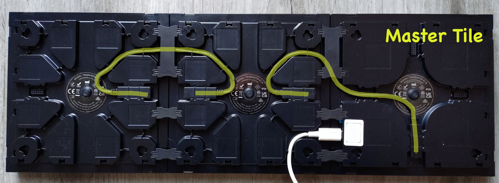

# Twockly - Twinkly Clock

Create a digital clock using 3 [Twinkly Squares](https://twinkly.com/products/squares).

Builds on the great work from [jschlyter/ttls](https://github.com/jschlyter/ttls).

## Layout

The current implementation is hardcoded to work with the following tile layout:



## Background

The overal idea here now is that we define a global `24 x 8` grid on which we can draw digits:

|  y\x| 0| 1| 2| 3| 4| 5| 6| 7| 8| 9|10|11|12|13|14|15|16|17|18|19|20|21|22|23|
|-----|--|--|--|--|--|--|--|--|--|--|--|--|--|--|--|--|--|--|--|--|--|--|--|--|
|**0**| ▫| ▫| ▫| ▫| ▫| ▫| ▫| ▫| ▫| ▫| ▫| ▫| ▫| ▫| ▫| ▫| ▫| ▫| ▫| ▫| ▫| ▫| ▫| ▫|
|**1**| ▫| ▫| ▫| ▫| ▫| ▫| ▫| ▫| ▫| ▫| ▫| ▫| ▫| ▫| ▫| ▫| ▫| ▫| ▫| ▫| ▫| ▫| ▫| ▫|
|**2**| ▫| ▫| ▫| ▫| ▫| ▫| ▫| ▫| ▫| ▫| ▫| ▫| ▫| ▫| ▫| ▫| ▫| ▫| ▫| ▫| ▫| ▫| ▫| ▫|
|**3**| ▫| ▫| ▫| ▫| ▫| ▫| ▫| ▫| ▫| ▫| ▫| ▫| ▫| ▫| ▫| ▫| ▫| ▫| ▫| ▫| ▫| ▫| ▫| ▫|
|**4**| ▫| ▫| ▫| ▫| ▫| ▫| ▫| ▫| ▫| ▫| ▫| ▫| ▫| ▫| ▫| ▫| ▫| ▫| ▫| ▫| ▫| ▫| ▫| ▫|
|**5**| ▫| ▫| ▫| ▫| ▫| ▫| ▫| ▫| ▫| ▫| ▫| ▫| ▫| ▫| ▫| ▫| ▫| ▫| ▫| ▫| ▫| ▫| ▫| ▫|
|**6**| ▫| ▫| ▫| ▫| ▫| ▫| ▫| ▫| ▫| ▫| ▫| ▫| ▫| ▫| ▫| ▫| ▫| ▫| ▫| ▫| ▫| ▫| ▫| ▫|
|**7**| ▫| ▫| ▫| ▫| ▫| ▫| ▫| ▫| ▫| ▫| ▫| ▫| ▫| ▫| ▫| ▫| ▫| ▫| ▫| ▫| ▫| ▫| ▫| ▫|


The digits are drawn by "painting in" certain `x,y` coordinates on the grid. For example if we wanted to create `12:34`:

|  y\x| 0| 1| 2| 3| 4| 5| 6| 7| 8| 9|10|11|12|13|14|15|16|17|18|19|20|21|22|23|
|-----|--|--|--|--|--|--|--|--|--|--|--|--|--|--|--|--|--|--|--|--|--|--|--|--|
|**0**| ▫| ▫| ▫| ▫| ▫| ▫| ▫| ▫| ▫| ▫| ▫| ▫| ▫| ▫| ▫| ▫| ▫| ▫| ▫| ▫| ▫| ▫| ▫| ▫|
|**1**| ▫| ▫| ▫| ▫| ■| ▫| ■| ■| ■| ■| ▫| ▫| ▫| ■| ■| ■| ■| ▫| ■| ▫| ▫| ■| ▫| ▫|
|**2**| ▫| ▫| ▫| ▫| ■| ▫| ▫| ▫| ▫| ■| ▫| ▫| ▫| ▫| ▫| ▫| ■| ▫| ■| ▫| ▫| ■| ▫| ▫|
|**3**| ▫| ▫| ▫| ▫| ■| ▫| ▫| ▫| ▫| ■| ▫| ■| ▫| ▫| ▫| ▫| ■| ▫| ■| ▫| ▫| ■| ▫| ▫|
|**4**| ▫| ▫| ▫| ▫| ■| ▫| ■| ■| ■| ■| ▫| ▫| ▫| ■| ■| ■| ■| ▫| ■| ■| ■| ■| ▫| ▫|
|**5**| ▫| ▫| ▫| ▫| ■| ▫| ■| ▫| ▫| ▫| ▫| ■| ▫| ▫| ▫| ▫| ■| ▫| ▫| ▫| ▫| ■| ▫| ▫|
|**6**| ▫| ▫| ▫| ▫| ■| ▫| ■| ▫| ▫| ▫| ▫| ▫| ▫| ▫| ▫| ▫| ■| ▫| ▫| ▫| ▫| ■| ▫| ▫|
|**7**| ▫| ▫| ▫| ▫| ■| ▫| ■| ■| ■| ■| ▫| ▫| ▫| ■| ■| ■| ■| ▫| ▫| ▫| ▫| ■| ▫| ▫|

For the `1` in the first position the following coordinates need to be painted `(4,1)`,`(4,2)`,`(4,3)`,`(4,4)`,`(4,5)`,`(4,6)`,`(4,7)` and for the `2` in the second position: `(6,1)`,`(7,1)`,`(8,1)`,`(9,1)`,`(9,2)`,`(9,3)`,`(9,4)`,`(8,4)`,`(7,4)`,`(6,4)`,`(6,5)`,`(6,6)`,`(6,7)`,`(7,7)`,`(8,7)`,`(9,7)` and so on.

These global coordinates then need to be mapped to the correct linear index in the frame. With the [layout above](#layout), the linear indices are as follows:

|  y\x|  0|  1|  2|  3|  4|  5|  6|  7| |  8|  9| 10| 11| 12| 13| 14| 15| | 16| 17| 18| 19| 20| 21| 22| 23|
|-----|---|---|---|---|---|---|---|---|-|---|---|---|---|---|---|---|---|-|---|---|---|---|---|---|---|---|
|**0**| 63| 62| 61| 60| 59| 58| 57| 56| |127|126|125|124|123|122|121|120| |191|190|189|188|187|186|185|184|
|**1**| 48| 49| 50| 51| 52| 53| 54| 55| |112|113|114|115|116|117|118|119| |176|177|178|179|180|181|182|183|
|**2**| 47| 46| 45| 44| 43| 42| 41| 40| |111|110|109|108|107|106|105|104| |175|174|173|172|171|170|169|168|
|**3**| 32| 33| 34| 35| 36| 37| 38| 39| | 96| 97| 98| 99|100|101|102|103| |160|161|162|163|164|165|166|167|
|**4**| 31| 30| 29| 28| 27| 26| 25| 24| | 95| 94| 93| 92| 91| 90| 89| 88| |159|158|157|156|155|154|153|152|
|**5**| 16| 17| 18| 19| 20| 21| 22| 23| | 80| 81| 82| 83| 84| 85| 86| 87| |144|145|146|147|148|149|150|151|
|**6**| 15| 14| 13| 12| 11| 10|  9|  8| | 79| 78| 77| 76| 75| 74| 73| 72| |143|142|141|140|139|138|137|136|
|**7**|  0|  1|  2|  3|  4|  5|  6|  7| | 64| 65| 66| 67| 68| 69| 70| 71| |128|129|130|131|132|133|134|135|

This is a front view with the master tile on the left; so the bottom left pixel of the master tile has index 0 and it then essentially "snakes" right until it reaches the right-most pixel of the tile, it then moves one up and then continues going left until it reaches the left-most pixel after which it moves one up again and then continues going right, etc.

```
...
↑ 31 ← 30 ← 29 ← 28 ← 27 ← 26 ← 25 ← 24 ←
→ 16 → 17 → 18 → 19 → 20 → 21 → 22 → 23 ↑
↑ 15 ← 14 ← 13 ← 12 ← 11 ← 10 ←  9 ←  8 ←
   0 →  1 →  2 →  3 →  4 →  5 →  6 →  7 ↑
```

After the last pixel of the tile is reached, the next tile starts at its bottom left again and the indices then "snake up" in the same way again. 

The `xyToIndex` function performs this translation of global coordinates to linear index:

1.  First it determines which tile the global coordinate is on; this is easily done by integer-dividing both `x` and `y` coordinates by `8`.

2.  It then looks up the tile information of this tile from the `tiles` nested-list. The `tiles` nested-list works with a similar grid, but not of individual pixels but rather entire tiles. The easiest way to look at this is to imagine what `tiles` would look like if it were to represent a 3-by-3 grid of tiles (instead of only a single row of 3 tiles), in this case it would be defined as follows:

    ```python
    tiles = [   
                [ (top-left-tile),   (top-center-tile),   (top-right-tile)    ],
                [ (middle-left-tile),(middle-center-tile),(middle-right-tile) ],
                [ (bottom-left-tile),(bottom-center-tile),(bottom-right-tile) ]
            ]
    ```

    Where each of the elements is a tuple in the form of `(tile_index, tile_orientation)`. Where `tile_index` represents that this is the `tile_index + 1`-th tile in the string and the `tile_orientation` represents how the tile is rotated exactly.

3.  It can then start computing the linear index by starting with an entire-tile-offset of `tile_index * 64`.

4.  And it then adds the "local" linear index. To compute the local index:
    
    1.  First convert the global `x` and `y` coordinate to local coordinates using "modulo 8".

    2.  Then do some math and logic to compute the local index based on these local coordinates. The math and logic varies based on the orientation of the tile in question. For now, there is only 1 implementation for the one specific orientation which you get with the [layout above](#layout).

